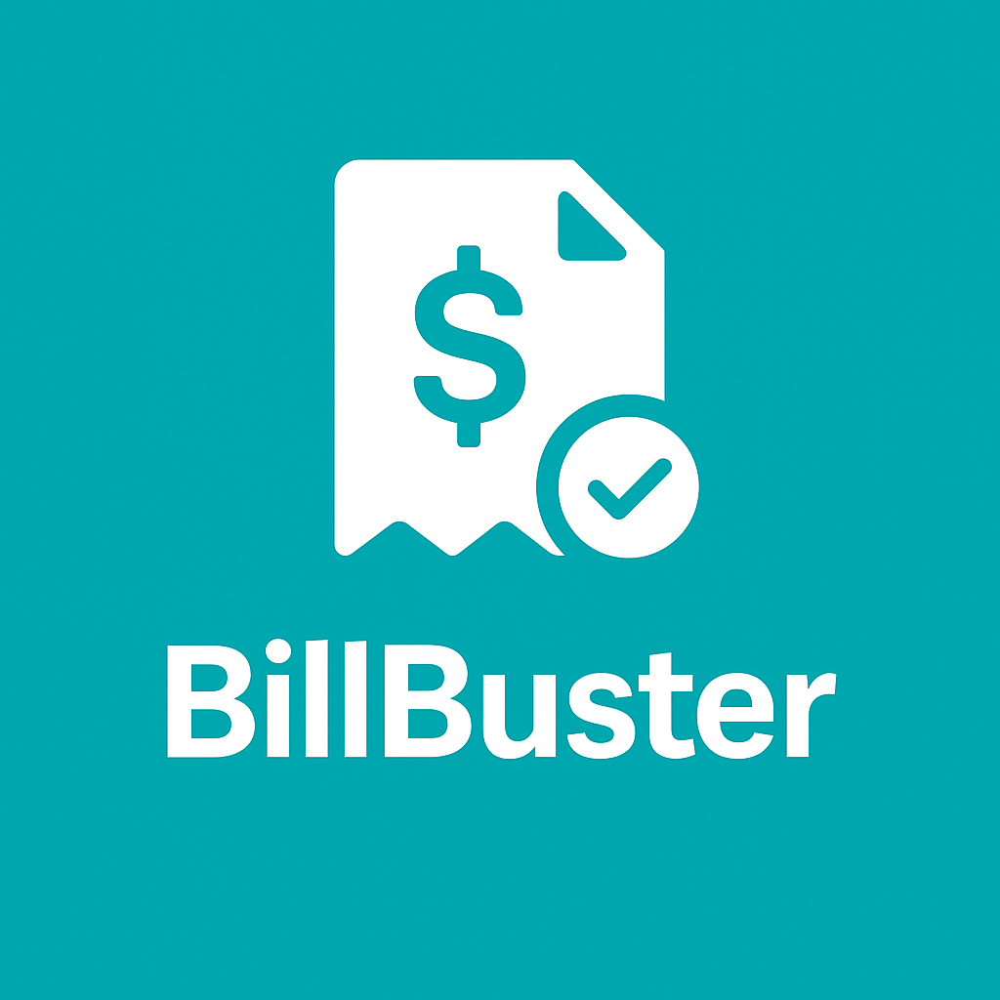

<p align="center">
  
</p>

<h1 align="center">BillBuster</h1>

<p align="center">
  <em>Smart Bill & Expense Splitter for Groups</em>  
</p>

---

## ✨ Features

- 📥 **Add Expenses** with custom members
- 📷 **Scan receipts** using VisionKit OCR
- ⚖️ **Fair splitting** among selected participants
- 💸 **UPI Payment** deep link generation
- 📲 **Send reminders** via SMS/iMessage
- 📊 **Analytics**: Category breakdown & weekly/monthly spend
- 🌗 **Dark mode support**
- ☁️ **iCloud-ready** architecture (coming soon)

---

## 📸 Screenshots

| Add Expense | Summary | Analytics |
|-------------|---------|-----------|
## 📸 Screenshots

<p align="center">
  
  
  
  
  
  
  
  
  
  
</p>---

## 🚀 Technologies Used

- **Swift 5 + SwiftUI**
- **VisionKit** (for receipt OCR)
- **MessageUI** (for SMS reminders)
- **Charts** (for analytics)
- **iCloud / CoreData** *(in progress)*

---

## 📦 Installation

1. Clone this repository:
   ```bash
   git clone https://github.com/krishaygahlaut/BillBuster.git